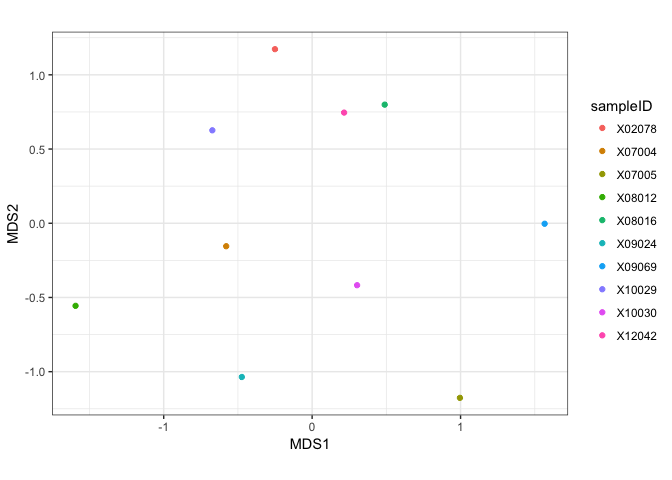
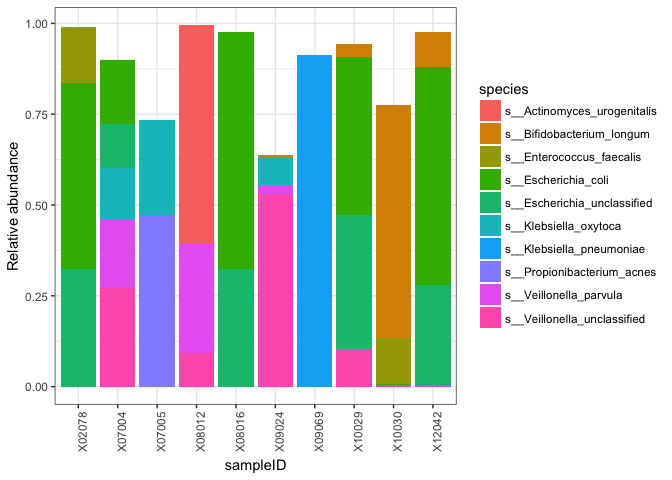

MetaPhlAn2
================
Tommi

MetaPhlAn2 analysis and visualization in R
==========================================

Set your working directory to where you have your data on your own computer (and install) and load needed libraries
-------------------------------------------------------------------------------------------------------------------

download data from <https://www.dropbox.com/s/agzc1fecgoj708z/infants_merged_table.txt?dl=0>

``` r
setwd("~/Dropbox/teaching/MetagenomeCourse2019/R_for_MetaPhlAn2/")
#install.packages("tidyverse")
#install.packages("vegan")
#install.packages("devtools")

library(tidyverse)
```

    ## ── Attaching packages ───────────────────────────────── tidyverse 1.2.1 ──

    ## ✔ ggplot2 2.2.1     ✔ purrr   0.2.4
    ## ✔ tibble  1.4.2     ✔ dplyr   0.7.4
    ## ✔ tidyr   0.8.0     ✔ stringr 1.4.0
    ## ✔ readr   1.1.1     ✔ forcats 0.3.0

    ## Warning: package 'stringr' was built under R version 3.5.2

    ## ── Conflicts ──────────────────────────────────── tidyverse_conflicts() ──
    ## ✖ dplyr::filter() masks stats::filter()
    ## ✖ dplyr::lag()    masks stats::lag()

``` r
library(vegan)
```

    ## Loading required package: permute

    ## Loading required package: lattice

    ## This is vegan 2.5-1

``` r
library(devtools)
```

    ## 
    ## Attaching package: 'devtools'

    ## The following object is masked from 'package:permute':
    ## 
    ##     check

``` r
# Use this to install microbiomics if needed:
install_github("tvatanen/microbiomics")
```

    ## Downloading GitHub repo tvatanen/microbiomics@master
    ## from URL https://api.github.com/repos/tvatanen/microbiomics/zipball/master

    ## Installing microbiomics

    ## '/Library/Frameworks/R.framework/Resources/bin/R' --no-site-file  \
    ##   --no-environ --no-save --no-restore --quiet CMD INSTALL  \
    ##   '/private/var/folders/fn/c7hlkwzs0qd0hm3klgt_jxqstnhy2f/T/RtmpriA833/devtoolsdedc1aeebd4f/tvatanen-microbiomics-3bb5e82'  \
    ##   --library='/Library/Frameworks/R.framework/Versions/3.5/Resources/library'  \
    ##   --install-tests

    ## 

``` r
library(microbiomics)
```

Read in the species from MetaPhlan table
----------------------------------------

``` r
metaphlan_species <- read_metaphlan_table("infants_merged_table.txt", lvl = 7, normalize = T)

rownames(metaphlan_species) <- sapply(rownames(metaphlan_species), function(x) strsplit(x, ".", fixed = T)[[1]][1])

mds_obj <- metaMDS(metaphlan_species)
```

    ## Run 0 stress 0.1564851 
    ## Run 1 stress 0.1723213 
    ## Run 2 stress 0.1686281 
    ## Run 3 stress 0.1693675 
    ## Run 4 stress 0.1698597 
    ## Run 5 stress 0.1686259 
    ## Run 6 stress 0.1361479 
    ## ... New best solution
    ## ... Procrustes: rmse 0.1521211  max resid 0.3594294 
    ## Run 7 stress 0.151936 
    ## Run 8 stress 0.1361479 
    ## ... Procrustes: rmse 2.272073e-06  max resid 4.544916e-06 
    ## ... Similar to previous best
    ## Run 9 stress 0.151936 
    ## Run 10 stress 0.1361479 
    ## ... Procrustes: rmse 2.522688e-06  max resid 4.892589e-06 
    ## ... Similar to previous best
    ## Run 11 stress 0.1643488 
    ## Run 12 stress 0.1822079 
    ## Run 13 stress 0.1723213 
    ## Run 14 stress 0.1361479 
    ## ... Procrustes: rmse 8.933526e-06  max resid 1.513911e-05 
    ## ... Similar to previous best
    ## Run 15 stress 0.1822152 
    ## Run 16 stress 0.151936 
    ## Run 17 stress 0.1361479 
    ## ... Procrustes: rmse 1.808752e-06  max resid 3.64211e-06 
    ## ... Similar to previous best
    ## Run 18 stress 0.1720604 
    ## Run 19 stress 0.151936 
    ## Run 20 stress 0.1693676 
    ## *** Solution reached

``` r
data.frame(mds_obj$points) %>%
  rownames_to_column("sampleID") %>%
  ggplot(aes(x=MDS1, y=MDS2, color = sampleID)) + 
  geom_point() +
  coord_equal() +
  theme_bw()
```



``` r
metaphlan_species_long <-
  metaphlan_species %>%
  rownames_to_column("sampleID") %>%
  gather(taxon_name, relative_abundance, -sampleID) %>%
  separate(taxon_name, sep = "\\.", into = c("kingdom", "phylum", "class", "order", "family", "genus", "species"))
  
species_stats <- 
  metaphlan_species_long %>%
  group_by(species) %>%
  summarize(mean_relative_abundance = mean(relative_abundance),
            median_relative_abundance = median(relative_abundance),
            max_relative_abundance = max(relative_abundance),
            prevalence = sum(relative_abundance > 0) / n())

head(species_stats %>% arrange(-mean_relative_abundance))
```

    ## # A tibble: 6 x 5
    ##   species   mean_relative_ab… median_relative… max_relative_ab… prevalence
    ##   <chr>                 <dbl>            <dbl>            <dbl>      <dbl>
    ## 1 s__Esche…            0.238          0.0887              0.654        0.7
    ## 2 s__Esche…            0.141          0.0616              0.367        0.8
    ## 3 s__Veill…            0.0997         0.000247            0.530        0.6
    ## 4 s__Klebs…            0.0917         0                   0.912        0.4
    ## 5 s__Bifid…            0.0779         0                   0.641        0.4
    ## 6 s__Actin…            0.0599         0                   0.599        0.1

Generate barplot of 10 most abundant species
--------------------------------------------

``` r
species_stats %>% 
  arrange(-mean_relative_abundance) %>%
  top_n(n = 10, wt = mean_relative_abundance) %>% 
  left_join(metaphlan_species_long) %>%
  ggplot(aes(y=relative_abundance, x=sampleID, fill = species)) +
  geom_bar(stat = "identity") +
  theme_bw() +
  ylab("Relative abundance") +
  theme(axis.text.x = element_text(angle = 90, hjust = 1))
```

    ## Joining, by = "species"



GeneratebBarplot of 10 most abundant genera
===========================================

``` r
metaphlan_genera_long <- 
  metaphlan_species_long %>%
  group_by(genus,sampleID) %>%
  summarise(relative_abundance = sum(relative_abundance)) %>%
  ungroup()
  
metaphlan_genera_long %>%
  group_by(genus) %>%
  summarize(mean_relative_abundance = mean(relative_abundance)) %>%
  arrange(-mean_relative_abundance) %>%
  top_n(n = 10, wt = mean_relative_abundance) %>%
  left_join(metaphlan_genera_long) %>%
  ggplot(aes(y=relative_abundance, x=sampleID, fill = genus)) +
  geom_bar(stat = "identity") +
  theme_bw() +
  ylab("Relative abundance")
```

    ## Joining, by = "genus"


