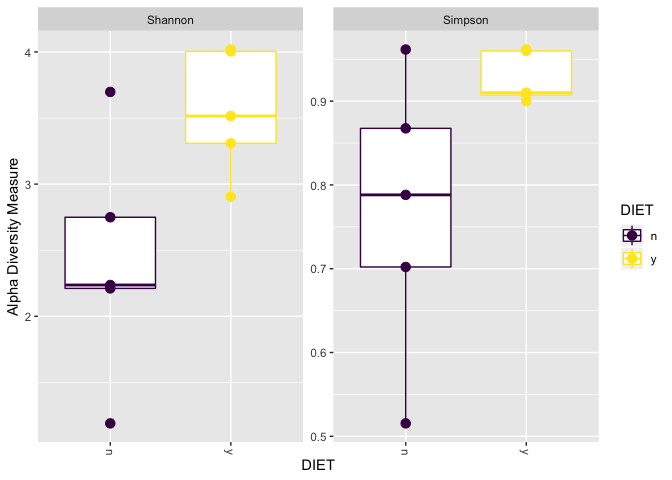
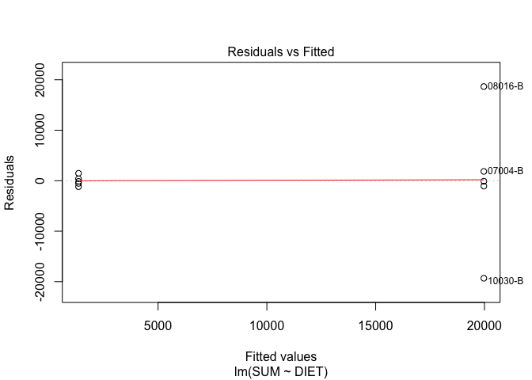
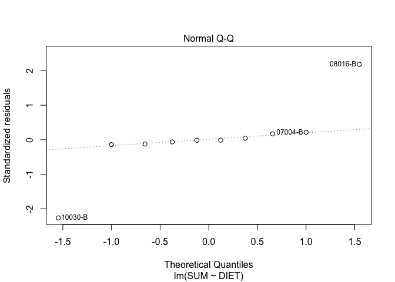
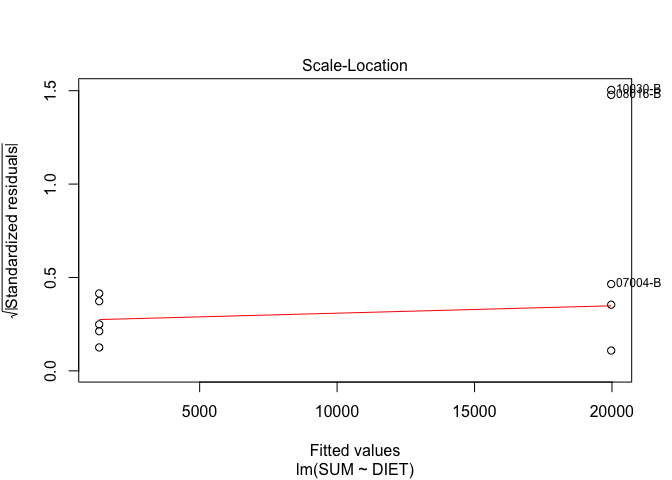
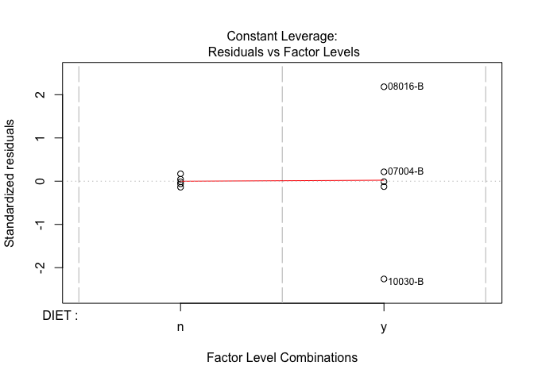
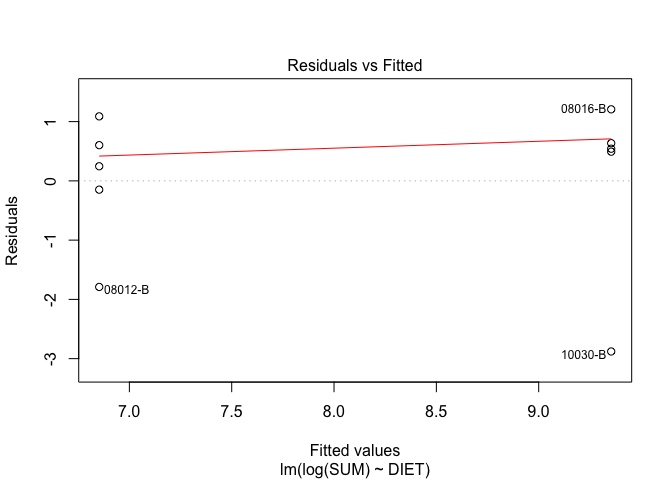
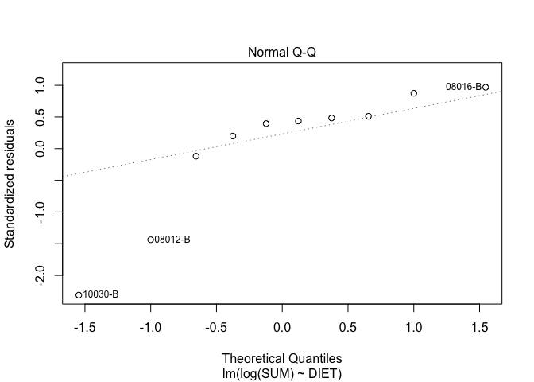
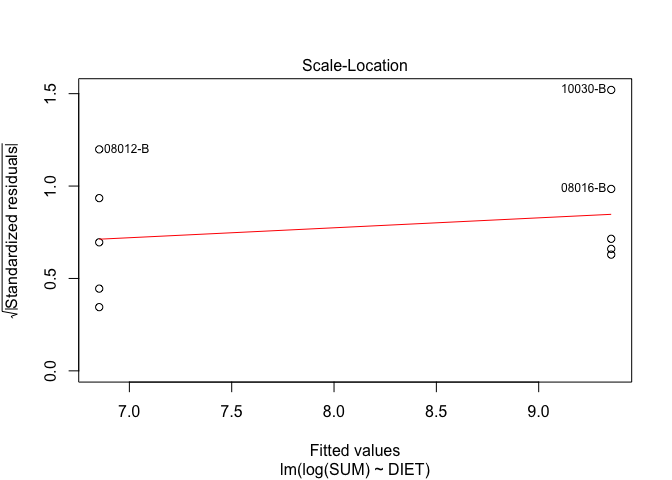
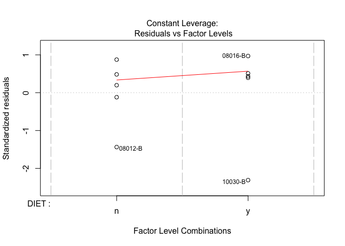

\#Crash course into statistics of metagenomic data: Multivariate
analysis and generalized linear models of overdispersed count data
================

# Setting up the R-environment and compiling data

### Setting up needed packages

First we will install and load packages which are needed for analysis.
Others are essential, viridis is used for getting colorblind friendly
colors.

``` r
#Install required libraries
#source('http://bioconductor.org/biocLite.R')
#biocLite('phyloseq')
#install.packages("vegan")
#install.packages("viridis")
#install.packages("MASS")
#install.packages("randomForest")

#Load libraries
library(phyloseq)
```

    ## Registered S3 methods overwritten by 'ggplot2':
    ##   method         from 
    ##   [.quosures     rlang
    ##   c.quosures     rlang
    ##   print.quosures rlang

``` r
library(viridis)
```

    ## Loading required package: viridisLite

``` r
library(vegan)
```

    ## Loading required package: permute

    ## Loading required package: lattice

    ## This is vegan 2.5-5

``` r
library(MASS)
library(ggplot2)
library(randomForest)
```

    ## randomForest 4.6-14

    ## Type rfNews() to see new features/changes/bug fixes.

    ## 
    ## Attaching package: 'randomForest'

    ## The following object is masked from 'package:ggplot2':
    ## 
    ##     margin

\#\#\#Normalizing data

Count data of metagenomes is almost always normalized to either library
sizes or 16S rRNA gene counts to get rid off variation that is caused
due to differences in library sizes or the numbers of bacteria. In our
case, we have a lot of non-bacterial DNA in our samples, and we are
quatifying genes which are found exclusively in bacteria. The amount of
bacterial DNA also varies between samples. This is why we will normalize
our data to 16S counts.

``` r
#Load in the ARG mapping result
ARG_bt<-as.matrix(read.table("ARG_genemat.txt", fill= 1, header= T, row.names = 1, check.names = F))

#Let's remove a gene which is not relevant for us

ARG_bt<-ARG_bt[grep('oqxB', row.names(ARG_bt), invert = TRUE),]

#Read in metadata
sample_data<-read.table("metadata.txt", sep="\t")

#Normalize to 16S counts
ARG_bt_norm<-t(t(ARG_bt)/sample_data$SSU_SUM)

#Check the division by using a random column and row
identical(ARG_bt[1083, 10]/sample_data$SSU_SUM[10], ARG_bt_norm[1083, 10])
```

    ## [1] TRUE

\#\#\#Phyloseq is handy for organizing and accessing data with counts,
taxonomy and metadata files

Let’s use Phyloseq to organize our data. Phyloseq is good for making
sure your columns and rows are always in the right order and it makes
accessing and splitting data faster.

``` r
#Make Phyloseq object with sample data and otu table. 
baby_ARG_PHY<-phyloseq(otu_table(ARG_bt_norm, taxa_are_rows = TRUE), sample_data(sample_data))

#Look at the sample sums
sample_sums(baby_ARG_PHY)
```

    ##    02078-BA     07004-B     07005-B     08012-B     08016-B     09024-B 
    ## 0.074913300 0.581419807 0.503755285 0.004215373 1.029364528 0.032269619 
    ##     09069-B    10029-BA     10030-B     12042-B 
    ## 0.021750126 0.046072683 0.017297040 0.529601504

``` r
#Check the sample data variable DIET
sample_data(baby_ARG_PHY)$DIET
```

    ##  [1] n y y n y n n n y y
    ## Levels: n y

\#\#Multivariate analysis

Often the research question is if there are differences in all genes
between samples that can be explained by an explanatory variable or
variables. This is when multivariate analysis methods come in handy.

Multivariate methods can be used to calculate distances between all
genes/taxa in samples using dissimilarity/similarity indexes and
ordinating the samples in a two-dimensional space for visualization. One
of the most commonly used distances in ecology is the Bray-Curtis
dissimilarity index. There are several distances such as Euclidean,
Jaccard and Horn-Morisita. However, it is best to use a method which
does not take zero values into account for metagenomic data.

Ordination methods are used to ordinate samples in relation to each
other in multiple dimensions. There are several ordination methods such
as NDMS, PCA and PCoA. We will use PCoA. Tranforming your data is often
needed before this, but we will skip it for the figure. The first two
dimensions or axes of the ordination can be used to plot the location of
samples in relation to each other in a two-dimensional space.

Phyloseq has vegan built-in so we can ordinate distances using Phyloseq
and plot the ordination.

Phyloseq has vegan built-in so we can ordinate distances using Phyloseq
and plot the ordination.

\#\#\#Ordination of samples using PCoAs and Bray-Curtis dissimilarity
index

``` r
#Ordinate using Phyloseq's ordinate command
baby_ARG_PHY_ord<-ordinate(baby_ARG_PHY, "PCoA", "bray")

#Plot ordination and color by Formula
p<-plot_ordination(baby_ARG_PHY, baby_ARG_PHY_ord, color="DIET")
p+scale_color_viridis(discrete = T) + geom_point(size=3) + theme_minimal()
```

<!-- -->

We can see that there are more purple points on the left. Let’s test if
the difference we see visually is also statistically significant using
the ‘adonis’ function from the vegan package. Now we will also square
root transform the count table which can be accessed by using the
function ‘otu\_table’ from the phyloseq package.

``` r
#We use a square root transformation for the data to even out variation
ARG_dist<-vegdist(sqrt(t((otu_table(baby_ARG_PHY)))), dist = "bray")

adonis(ARG_dist~DIET, data=data.frame(sample_data(baby_ARG_PHY), permutations = 9999))
```

    ## 
    ## Call:
    ## adonis(formula = ARG_dist ~ DIET, data = data.frame(sample_data(baby_ARG_PHY),      permutations = 9999)) 
    ## 
    ## Permutation: free
    ## Number of permutations: 999
    ## 
    ## Terms added sequentially (first to last)
    ## 
    ##           Df SumsOfSqs MeanSqs F.Model      R2 Pr(>F)  
    ## DIET       1    0.7378 0.73776  2.0805 0.20639  0.034 *
    ## Residuals  8    2.8368 0.35460         0.79361         
    ## Total      9    3.5746                 1.00000         
    ## ---
    ## Signif. codes:  0 '***' 0.001 '**' 0.01 '*' 0.05 '.' 0.1 ' ' 1

We can conclude that is some diffference in the grouping of genes based
on the explanatory variables. (The separation is borderline significant
using alpha of 0.05). Adonis calculates the result using permutations,
so there can be some variation in the p-values and model estimates with
lower numbers of permutations. If we would like to know which individual
genes are different we could use the R-package DeSEQ to investigate fold
changes between the two groups or fit genes as vectors in the ordination
using ‘envfit’ from vegan package.

## Analysis of diversity

The diversity of bacteria or genes can differ between groups and is
often interesting to study. Again, there are several diversity indeces,
but in most cases it is best to use an indes which takes both evenness
and the number of different taxa or genes into account when analysing
metagenomes.

Phyloseq is able to plot diversities so we will use the ‘plot\_richness’
function from
phyloseq.

``` r
p<-plot_richness(baby_ARG_PHY, measures = c("Shannon", "Simpson"), x = "DIET", color="DIET")
```

    ## Warning in estimate_richness(physeq, split = TRUE, measures = measures): The data you have provided does not have
    ## any singletons. This is highly suspicious. Results of richness
    ## estimates (for example) are probably unreliable, or wrong, if you have already
    ## trimmed low-abundance taxa from the data.
    ## 
    ## We recommended that you find the un-trimmed data and retry.

``` r
p+geom_boxplot() +
scale_color_viridis(discrete=TRUE) +
geom_point(size=3)
```

<!-- -->

Again, it looks like there might be a difference between the groups, but
lets check if it’s significant or not using ANOVA, which compares the
variances between the two
groups.

``` r
shannon<-aov(diversity(t(otu_table(baby_ARG_PHY)), index = "shannon")~sample_data(baby_ARG_PHY)$DIET, 
             data=as.data.frame(otu_table(baby_ARG_PHY)))
TukeyHSD(shannon)
```

    ##   Tukey multiple comparisons of means
    ##     95% family-wise confidence level
    ## 
    ## Fit: aov(formula = diversity(t(otu_table(baby_ARG_PHY)), index = "shannon") ~ sample_data(baby_ARG_PHY)$DIET, data = as.data.frame(otu_table(baby_ARG_PHY)))
    ## 
    ## $`sample_data(baby_ARG_PHY)$DIET`
    ##         diff        lwr      upr     p adj
    ## y-n 1.133848 0.07296601 2.194729 0.0390373

``` r
simpson<-aov(diversity(t(otu_table(baby_ARG_PHY)), index = "simpson")~sample_data(baby_ARG_PHY)$DIET, 
             data=as.data.frame(otu_table(baby_ARG_PHY)))
TukeyHSD(simpson)
```

    ##   Tukey multiple comparisons of means
    ##     95% family-wise confidence level
    ## 
    ## Fit: aov(formula = diversity(t(otu_table(baby_ARG_PHY)), index = "simpson") ~ sample_data(baby_ARG_PHY)$DIET, data = as.data.frame(otu_table(baby_ARG_PHY)))
    ## 
    ## $`sample_data(baby_ARG_PHY)$DIET`
    ##         diff         lwr       upr     p adj
    ## y-n 0.160844 -0.01750545 0.3391935 0.0711523

It turns out that the difference is not significant using Simpson
diversity but is with Shannon.

## Statistical analysis of overdispersed count data

Many read based metagenomic analyses produce outputs in table formats
with counts. During the course we have analysed our data and counted
ARGs in each sample by mapping them to an ARG database. We need to
decide which statistical methods are most appropriate for out data, in
order to analyse the effects of the ‘DIET’ explanatory variable on the
ARG counts.

In traditional statistics, count data is usually modelled using Poisson
or binomial distibutions. Poisson is a discrete probability distribution
that expresses the probability of a given number of events occurring in
a fixed interval of time or space IF these events occur with a known
constant rate and independently of the time since the last event. For
instance, a person keeping track of the amount of mail they receive each
day may notice that they receive an average number of 4 letters per day.
If receiving any particular piece of mail does not affect the arrival
times of future pieces of mail, i.e., if pieces of mail from a wide
range of sources arrive independently of one another, then a reasonable
assumption is that the number of pieces of mail received in a day obeys
a Poisson distribution. However, more often than not this is not the
case for real life events and biological data.

The starting point for count data is a GLM (generalized linear model)
with Poisson-distributed errors, but not all count data meet the
assumptions of the Poisson distribution. Poisson distribution requires
that the variance is NOT larger than the mean (overdispersed) and that
there aren’t more zeros than expected in the data (zero inflation).

The binomial distribution is frequently used to model the number of
successes in a sample of size n drawn with replacement from a population
of size N. If the sampling is carried out without replacement, the draws
are not independent and so the resulting distribution is a
hypergeometric distribution, not a binomial one. However, for N much
larger than n, the binomial distribution remains a good approximation,
and is widely used. As with the Poisson distribution, binomial
distribution’s assumptions include that there is no overdispersion and
zero inflation.

Some also often use normally distributed models and log transfor their
data, but in most cases the models will end up beign less than optimal.
Why not use the right model for your data instead of
compromizing?

### Checking which model is best - Poisson, Quasipoisson or Negative Binomial

``` r
#Save the total sum of ARGs/average 16S rRNA gene copies to a dataframe for each sample and info of the DIET 
df<-data.frame(SUM=round(mean(sample_data(baby_ARG_PHY)$SSU_SUM)*(sample_sums(baby_ARG_PHY))),
               DIET=as.factor(sample_data(baby_ARG_PHY)$DIET))

#First we can plot the data using boxplots, which plot the interquartile ranges and median
plot(df$SUM~df$DIET)
```

<!-- -->

You can see that there might be a difference between ‘n’ and ‘y’, but
there is large variation between the samples in the ‘y’ group which has
the bigger median. This already gives us an idication that there is a
lot of variation in the data and that is definately not suitable for the
Poisson model.

### Let’s fit a linear model to the data

``` r
model.ln<-lm(SUM~DIET, data=df)
summary(model.ln)
```

    ## 
    ## Call:
    ## lm(formula = SUM ~ DIET, data = df)
    ## 
    ## Residuals:
    ##      Min       1Q   Median       3Q      Max 
    ## -19323.0   -935.5   -117.5   1195.5  18651.0 
    ## 
    ## Coefficients:
    ##             Estimate Std. Error t value Pr(>|t|)  
    ## (Intercept)     1345       4271   0.315    0.761  
    ## DIETy          18627       6041   3.084    0.015 *
    ## ---
    ## Signif. codes:  0 '***' 0.001 '**' 0.01 '*' 0.05 '.' 0.1 ' ' 1
    ## 
    ## Residual standard error: 9551 on 8 degrees of freedom
    ## Multiple R-squared:  0.5431, Adjusted R-squared:  0.486 
    ## F-statistic: 9.509 on 1 and 8 DF,  p-value: 0.01503

P-value looks good, but does the data fit the normality assumption

``` r
shapiro.test(df$SUM)
```

    ## 
    ##  Shapiro-Wilk normality test
    ## 
    ## data:  df$SUM
    ## W = 0.78155, p-value = 0.008645

``` r
plot(model.ln)
```

<!-- --><!-- --><!-- --><!-- -->

The Shapiro-Wilks test gives us a siginificant p-value, which means that
the data significantly differs from the normal distribution. It also
looks like we might have an s-shaped curve in the normality Q-Q plot.

### Let’s try a linear model with a log transformation

``` r
model.logln<-lm(log(SUM)~DIET, data=df)
summary(model.logln)
```

    ## 
    ## Call:
    ## lm(formula = log(SUM) ~ DIET, data = df)
    ## 
    ## Residuals:
    ##      Min       1Q   Median       3Q      Max 
    ## -2.87885 -0.04945  0.51771  0.62777  1.20732 
    ## 
    ## Coefficients:
    ##             Estimate Std. Error t value Pr(>|t|)    
    ## (Intercept)    6.853      0.623   11.00 4.15e-06 ***
    ## DIETy          2.502      0.881    2.84   0.0218 *  
    ## ---
    ## Signif. codes:  0 '***' 0.001 '**' 0.01 '*' 0.05 '.' 0.1 ' ' 1
    ## 
    ## Residual standard error: 1.393 on 8 degrees of freedom
    ## Multiple R-squared:  0.502,  Adjusted R-squared:  0.4397 
    ## F-statistic: 8.064 on 1 and 8 DF,  p-value: 0.02182

Again everything looks good but how’s the normality.

``` r
shapiro.test(log(df$SUM))
```

    ## 
    ##  Shapiro-Wilk normality test
    ## 
    ## data:  log(df$SUM)
    ## W = 0.91911, p-value = 0.3496

``` r
plot(model.logln)
```

<!-- --><!-- --><!-- --><!-- -->

Now the data fits the normality assumption.

### Let’s try and fit a Poisson model to the data

``` r
model.pois = glm(SUM ~ DIET , data = df, family = poisson)
summary(model.pois)
```

    ## 
    ## Call:
    ## glm(formula = SUM ~ DIET, family = poisson, data = df)
    ## 
    ## Deviance Residuals: 
    ##      Min        1Q    Median        3Q       Max  
    ## -184.928   -13.590    -2.216    12.147   116.803  
    ## 
    ## Coefficients:
    ##             Estimate Std. Error z value Pr(>|z|)    
    ## (Intercept)  7.20415    0.01219   590.8   <2e-16 ***
    ## DIETy        2.69794    0.01260   214.2   <2e-16 ***
    ## ---
    ## Signif. codes:  0 '***' 0.001 '**' 0.01 '*' 0.05 '.' 0.1 ' ' 1
    ## 
    ## (Dispersion parameter for poisson family taken to be 1)
    ## 
    ##     Null deviance: 148910  on 9  degrees of freedom
    ## Residual deviance:  51332  on 8  degrees of freedom
    ## AIC: 51435
    ## 
    ## Number of Fisher Scoring iterations: 5

This looks pretty good if you just look at the the p-value, but the
residual devience and AIC values, which indicate how well the model
explains the variance in the data are big. This means that the model is
not good at explaining the
deviance.

### Let’s check if the deviance is above the 0.95 critical value for the chi squared thest with 9 degrees of freedom

``` r
qchisq(0.95, df.residual(model.pois))#Critical value
```

    ## [1] 15.50731

``` r
#Actual deviance for the Poisson model
deviance(model.pois)
```

    ## [1] 51331.7

``` r
#The deviance is much larger than 15.5

#Let's calculate the residual deviance also using the Pearson chi-squared test
pr <- residuals(model.pois,"pearson")

sum(pr^2)
```

    ## [1] 39317.15

``` r
#The deviance is again a lot higher that the critical value for the chi squared test


#Now if we assume that the variance is proportional rather than equal to the mean,
#we can use a Poisson model with the quasipoisson extension. The scale parameter φ can be estimated by dividing Pearson's chi-squared by its d.f.:
phi <- sum(pr^2)/df.residual(model.pois)

round(c(phi,sqrt(phi)),4)
```

    ## [1] 4914.6439   70.1045

``` r
#We see that the variance is 4914.6439 times larger than the mean. 
#This means that we should adjust the standard errors multiplying by 70.1045, the square root of 4914.6439

#R can do this calculation for us if we use the quasipoisson family:


model.qpois<-glm(SUM~DIET, data=df, family="quasipoisson")

summary(model.qpois)
```

    ## 
    ## Call:
    ## glm(formula = SUM ~ DIET, family = "quasipoisson", data = df)
    ## 
    ## Deviance Residuals: 
    ##      Min        1Q    Median        3Q       Max  
    ## -184.928   -13.590    -2.216    12.147   116.803  
    ## 
    ## Coefficients:
    ##             Estimate Std. Error t value Pr(>|t|)    
    ## (Intercept)   7.2041     0.8549   8.427    3e-05 ***
    ## DIETy         2.6979     0.8832   3.055   0.0157 *  
    ## ---
    ## Signif. codes:  0 '***' 0.001 '**' 0.01 '*' 0.05 '.' 0.1 ' ' 1
    ## 
    ## (Dispersion parameter for quasipoisson family taken to be 4914.644)
    ## 
    ##     Null deviance: 148910  on 9  degrees of freedom
    ## Residual deviance:  51332  on 8  degrees of freedom
    ## AIC: NA
    ## 
    ## Number of Fisher Scoring iterations: 5

``` r
#The estimates are exactly the same as before, but the standard
#errors are about 70X larger and the p-value is larger. 
#We can verify this fact easily. First we write a useful function to extract standard errors and then use it on our fits:

se <- function(model) sqrt(diag(vcov(model)))

round(data.frame(poisson=coef(model.pois), 
                 qpoisson=coef(model.qpois), 
                 se.poisson=se(model.pois), 
                 se.qpoisson=se(model.qpois), 
                 ratio=se(model.qpois)/se(model.pois)), 4)
```

    ##             poisson qpoisson se.poisson se.qpoisson   ratio
    ## (Intercept)  7.2041   7.2041     0.0122      0.8549 70.1045
    ## DIETy        2.6979   2.6979     0.0126      0.8832 70.1045

# Negative binomial distribution

Negative binomial distributions are an other option for overdispersed
data. Negative binomial models are a bit more advanced in modelling the
deviance.

``` r
model.nb <- glm.nb(SUM~DIET, data=df)

summary(model.nb)
```

    ## 
    ## Call:
    ## glm.nb(formula = SUM ~ DIET, data = df, init.theta = 1.253115268, 
    ##     link = log)
    ## 
    ## Deviance Residuals: 
    ##     Min       1Q   Median       3Q      Max  
    ## -2.4821  -0.4160  -0.0334   0.2450   0.9400  
    ## 
    ## Coefficients:
    ##             Estimate Std. Error z value Pr(>|z|)    
    ## (Intercept)   7.2041     0.3997  18.024  < 2e-16 ***
    ## DIETy         2.6979     0.5651   4.774 1.81e-06 ***
    ## ---
    ## Signif. codes:  0 '***' 0.001 '**' 0.01 '*' 0.05 '.' 0.1 ' ' 1
    ## 
    ## (Dispersion parameter for Negative Binomial(1.2531) family taken to be 1)
    ## 
    ##     Null deviance: 29.324  on 9  degrees of freedom
    ## Residual deviance: 11.259  on 8  degrees of freedom
    ## AIC: 196.77
    ## 
    ## Number of Fisher Scoring iterations: 1
    ## 
    ## 
    ##               Theta:  1.253 
    ##           Std. Err.:  0.503 
    ## 
    ##  2 x log-likelihood:  -190.770

``` r
#R's theta is the precision of the multiplicative random effect, and corresponds to 1/σ2 (σ2 = variance) in the notes. 
#The estimate corresponds to an estimated variance of 0.798 and is highly significant.

1/model.nb$theta
```

    ## [1] 0.7980112

``` r
#0.7980112

#Let's estimate the dispersion in the negative binomial model
-2*(logLik(model.pois)-logLik(model.nb))
```

    ## 'log Lik.' 51240.35 (df=2)

``` r
#Let's compare the results from linear models, Poisson, quasipoisson and negative binomial models

data.frame(linear=coef(model.ln),
                 loglinear=exp(coef(model.logln)),
                 poisson=exp(coef(model.pois)),
                 qpoisson=exp(coef(model.qpois)),
                 negbin=exp(coef(model.nb)),
                 se.ln=(se(model.ln)),
                 se.logln=exp(se(model.logln)),
                 se.pois=exp(se(model.pois)),
                 se.qpoisson=exp(se(model.qpois)),
                 se.negbin=exp(se(model.nb)))
```

    ##             linear loglinear    poisson   qpoisson     negbin    se.ln
    ## (Intercept)   1345 946.30132 1345.00000 1345.00000 1345.00000 4271.414
    ## DIETy        18627  12.20351   14.84907   14.84907   14.84907 6040.692
    ##             se.logln  se.pois se.qpoisson se.negbin
    ## (Intercept) 1.864423 1.012269    2.351068  1.491360
    ## DIETy       2.413279 1.012678    2.418593  1.759663

``` r
#Now if we remember the 95% cutoff from chi-squared test was 15.50731
deviance(model.ln)
```

    ## [1] 729799086

``` r
#We have 729799086 deviance in the linear model
deviance(model.logln)
```

    ## [1] 15.52274

``` r
#We have 15.52274 deviance in the log linear model
deviance(model.pois)
```

    ## [1] 51331.7

``` r
#We have 51331.7 deviance in the Poisson model
deviance(model.qpois)
```

    ## [1] 51331.7

``` r
#The deviance is the same in the quasipoisson which estimates the deviance in the confidence intervals
deviance(model.nb)
```

    ## [1] 11.25934

``` r
#The deviance in the negative binomial model is 11.25934,
#which is below the cutoff value which indicates that the negative binomial model is a good fit for the data.
```

### Checking variances between models

The over-dispersed Poisson (quasipoisson) and negative binomial models
have different variance functions. One way to check which one may be
more appropriate is to create groups based on the linear predictor,
compute the mean and variance for each group, and finally plot the
mean-variance relationship. Unfortunately, our data doesn’t have enough
data points to be able to get a nice look at the variance functions, but
let’s look at the variance plot produced by Univ. of Princeton people.

<https://data.princeton.edu/wws509/r/overdispersion>

The graph plots the mean versus the variance and overlays the curves
corresponding to the over-dispersed Poisson model, where the variance is
φμ, and the negative binomial model, where the variance is μ(1+μσ2).

The Poisson variance function does a pretty good job for the bulk of
most data, but fails to capture the high variances of the most
productive scholars. The negative binomial variance function is not too
different but, being a quadratic, can rise faster and does a better job
at the high end. We conclude that the negative binomial model provides a
better description of the data than the over-dispersed Poisson model.

# Machine learning with randomforests

Machine learning allows to look at effects which are not linear and has
many applications in data science. You can also use them to look at
metagenome data.

``` r
#Random forests to get the best predictors for ARG sum abundance
df <- data.frame(SUM=mean(sample_data(baby_ARG_PHY)$SSU_SUM)*sample_sums(baby_ARG_PHY), DIET=sample_data(baby_ARG_PHY)$DIET, Age=sample_data(baby_ARG_PHY)$Age)


#Save variables for ARG model
y<-df$SUM
x<-df[,2:3]
dfr<-cbind(x, y)


#Fit the model
fit <- randomForest(y ~Age+DIET, df,ntree=1000)
predicted= predict(fit,x)

#Look at the preduicted values
predicted
```

    ##  02078-BA   07004-B   07005-B   08012-B   08016-B   09024-B   09069-B 
    ##  3058.530 20417.238 21148.690  2241.990 21502.530  3039.490  2553.131 
    ##  10029-BA   10030-B   12042-B 
    ##  3413.208 13463.557 20417.238

``` r
#Print
print(fit)
```

    ## 
    ## Call:
    ##  randomForest(formula = y ~ Age + DIET, data = df, ntree = 1000) 
    ##                Type of random forest: regression
    ##                      Number of trees: 1000
    ## No. of variables tried at each split: 1
    ## 
    ##           Mean of squared residuals: 110122510
    ##                     % Var explained: 31.05
